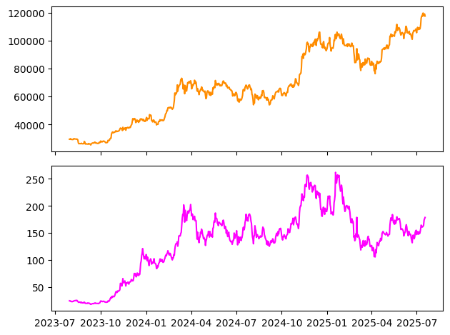
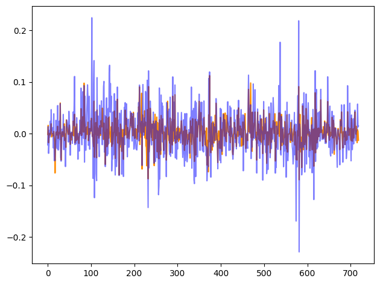
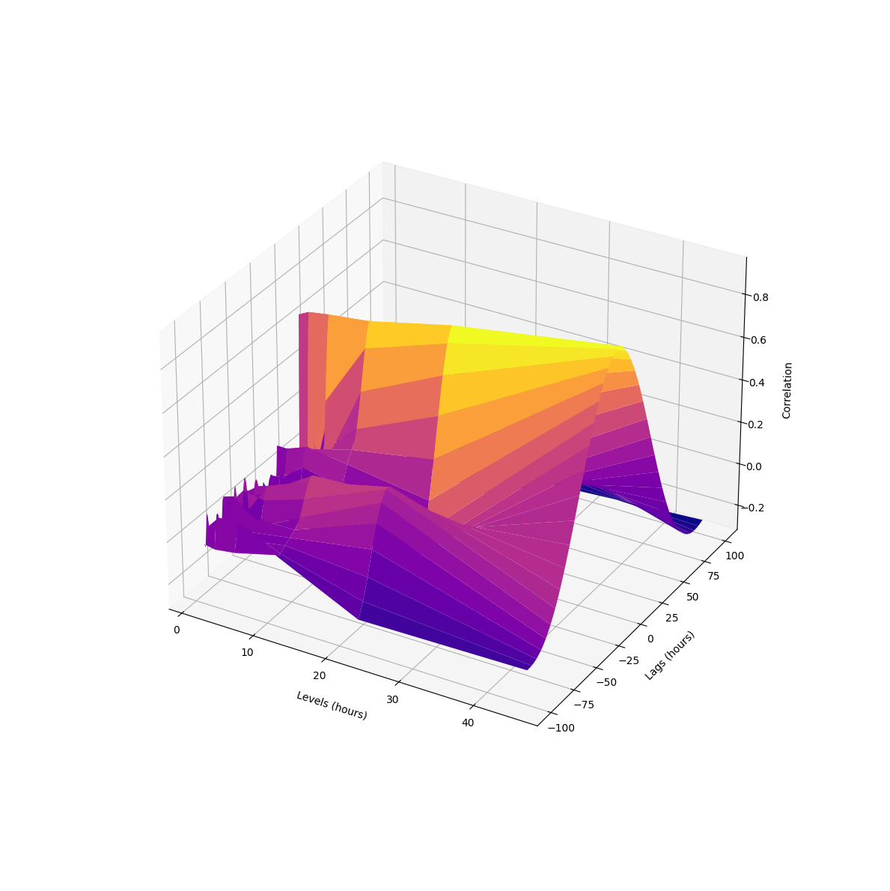

# Wavelet-Variance (MODWTVAR)
Python implementations similar of modwtvar and modwtxcorr found in MATLAB. 

Methods from 
- Chapter 7 from Gençay, R., Selçuk, F., &amp; Whitcher, B. (2002). An introduction to wavelets and other filtering methods in finance and economics
- Chapter 8 from 	Percival D., Walden, A., Cambridge University Press, 2000, Wavelet Methods for Time Series Analysis

Based on PyWavelets (https://pywavelets.readthedocs.io) and Pistonly's MODWT implementation (https://github.com/pistonly/modwtpy)

## Requirements
PyWavelets
SciPy
```
pip install pywavelets
pip install SciPy
```
## Example
Wavelet correlation between BTC and SOL. Last figure shows correlations at different lags and different levels

```python
fig, ax = plt.subplots(2, 1, sharex=True)
ax[0].plot(btc_df["close"],  color='darkorange')
ax[1].plot(sol_df["close"], color='magenta')

plt.tight_layout()
plt.show()

```


    

    


```python
figur = plt.figure()

plt.plot(btc_logr, color="darkorange", alpha = 1)
plt.plot(sol_logr, color="blue", alpha = 0.5)
plt.tight_layout()
plt.show()


```


    

    


```python
wavelet_correlation_CI(btc_logr, sol_logr,  "sym4", 6, 0, 0.05)
```


    [0.9232050543381239, 0.9388778358219667, 0.9514327953624999]


```python
lags = [i for i in range(-100, 101)]
levels = [i for i in range(1,7)]
P1, P2 = np.meshgrid(levels, lags)
Z = np.array([[wavelet_correlation(btc_logr, sol_logr, "sym4", P1, P2) for P1 in levels] for P2 in lags])
```


```python
fig = plt.figure(figsize=(20, 12))
ax = fig.add_subplot(111, projection='3d')
ax.plot_surface(2**(P1-0.5), P2, Z, cmap='plasma')
ax.set_xlabel('Levels (hours)', labelpad=15)
ax.set_ylabel('Lags (hours)', labelpad=15)
ax.set_zlabel('Correlation',labelpad=15)
ax.set_box_aspect(None, zoom=0.75) 
plt.tight_layout()
plt.show()
```


    

    


